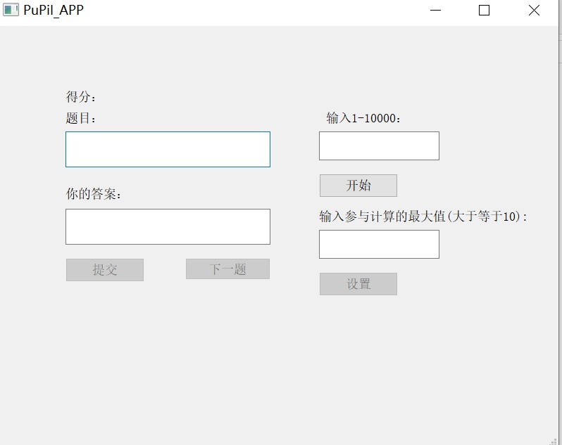
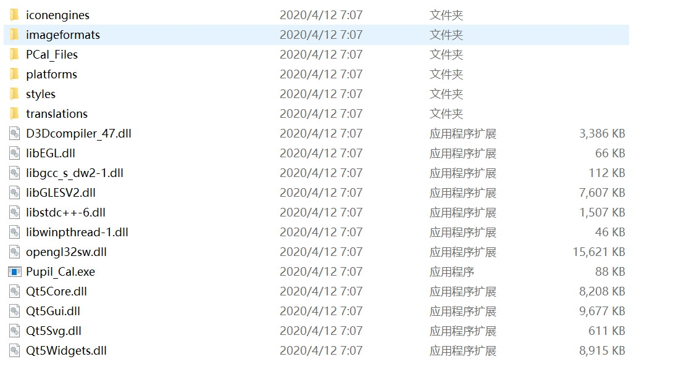

# 小学生加减

## 简介

- 如果你只想运行此程序，将Pupil_APP文件夹下载到本地，里面有可运行文件和环境
- Pupil_Cal文件夹存放的是代码，你可以跳转到这里下载适合在vs中运行的版本[vs](https://github.com/Mazeqi/Pupil_Cal)
- 在Pupil_APP中，PCAl_Files文件夹是存放运行输出txt的文件夹

## 程序封面

### Pupil_Cal 文件夹组成

